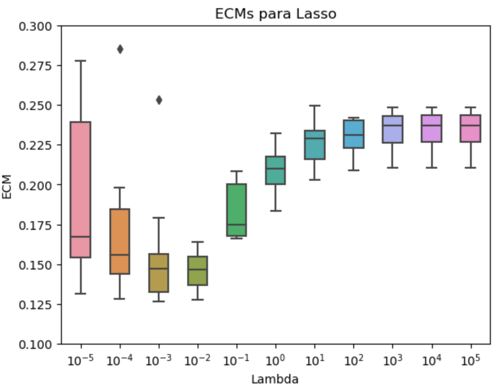

# Poverty Prediction - Machine Learning Course

## General information
* Department of Economics - Universidad de San Andrés
* Resources for learning and teaching applied machine learning with Python. Problem sets and reports aimed at improving poverty prediction with and without income data.

The final Jupyter Notebook and report can be found **[here](https://github.com/mateoservent/Big-Data/tree/main/Code/TP4)**.

